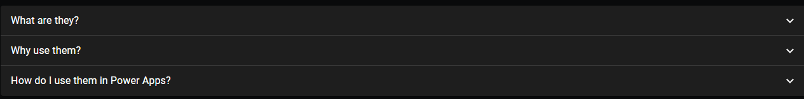
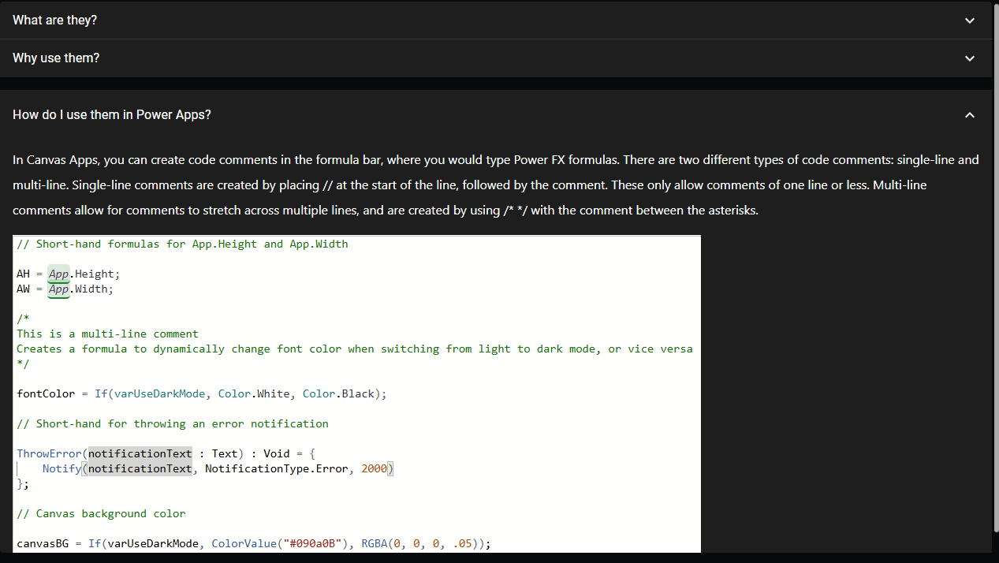

# Material UI Accordion (PCF COMPONENT)

## Description
###

## Table of Contents

- [Demo](#Demo)
- [Input Properties](#input-properties)
- [Output properties](#output-properties)

## Demo




</img>

<br>
<br>




</img>


# Input Properties Links
- [Fields](#fields)
- [accordionData](#accordiondata)
- [DarkMode](#darkmode)
- [useTestData](#usetestdata)

<br>

# Output Properties Links

- [outputHeight](#outputheight)

<br>

# Input Properties

<br>

## Fields 
This property is contained within Power Apps itself, it won't appear in the code here, but it is a field well in power apps that will allow you to select which fields are passed to the component.


<br>

## accordionData
### Type: Table
### This is the main data that will make up the accordion. Each row in this table will has three possible properties: 
- #### Title (string) - this will be the text that displays when the accordion row is in the collapsed state
- #### bodyContent (string) - this will be the text that is displayed when the accordion row is in the expanded state
- #### images (table) - you list a table of images here that will render below the bodyContent. The properties for each record are src (string) - the url for the image, height (string) - the height of the image, and width (string), the width of the image. 

### This is the example we will be working with: 

```
[
    {
        Title: "What are they?",
        bodyContent: "Code comments are remarks left by developers inside the code of software so that other developers (or themselves) can tell at a glance what a piece of code is supposed to do, rather than trying to analyze the entire block of code."
    },
    {
        Title: "Why use them?",
        bodyContent: "You should use code comments, particularly for complicated or lengthy blocks of code, because when viewing code for the first time in a while, it can be difficult to tell at a glance what something is supposed to do, so comments will help you make sense of the code. It is also a useful tool to create visual breaks in code, which helps our brains process things better than one long, singular block of code."
    },
    {
        Title: "How do I use them in Power Apps?",
        bodyContent: "In Canvas Apps, you can create code comments in the formula bar, where you would type Power FX formulas. There are two different types of code comments: single-line and multi-line. Single-line comments are created by placing // at the start of the line, followed by the comment. These only allow comments of one line or less. Multi-line comments allow for comments to stretch across multiple lines, and are created by using /* */ with the comment between the asterisks.",
        images: [
            {
                src: "https://res.cloudinary.com/dsvmviwkc/image/upload/f_auto,q_auto/o1j1imdwljwpfie3ikai",
                height: "411px",
                width: "873px"
            }
        ]
    }
]
```

<br>

### DarkMode
### Type: boolean
### When set to true, this component will render in Dark mode

### useTestData
### Type: boolean
### When set to true, this component renders using a set of pre-defined data. When turned off, it will render using the custom data passed into the control. Make sure you add your fields to the field well before turning this off.

<br>

# Output properties

## outputHeight
### Type: number
### The total output height of the control. Useful for conditional positioning with other control relative to on expanded/collapsed state