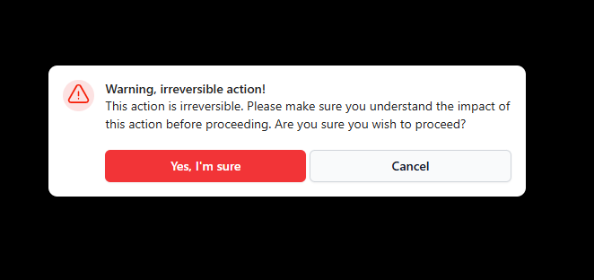
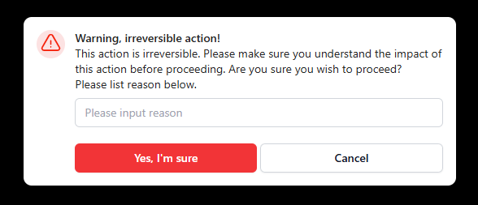
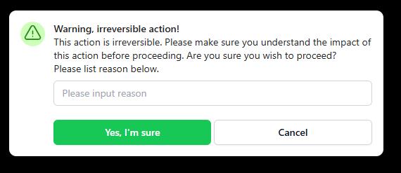
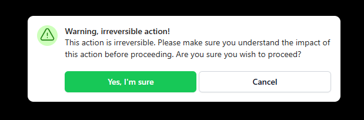

# Material UI Modal component for Power Apps (PCF COMPONENT)

## Description
### This is a modal component that offers a sleek aesthetic pop-up modal to warn a user of a destructive action, prompt users for confirmation before executing an action, etc.

## Table of Contents

- [Demo](#Demo)
- [Input Properties](#input-properties)
- [Output properties](#output-properties)
- [Events](#events)

## Demo

# Input Properties Links

- [dialogHeader](#dialogheader)
- [dialogText](#dialogtext)
- [confirmText](#confirmtext)
- [modalType](#modaltype)
- [includeTextInput](#includetextinput)
- [textInputPlaceholder](#textinputplaceholder)
- [containerWidth](#containerwidth)
- [containerHeight](#containerheight)

# Output Properties Links

- [outputText](#outputtext)

 # Events Links

- [onConfirm](#onconfirm)
- [onConfirm](#oncancel)

 

# Input Properties

 

## dialogHeader
### Type: string
### This is the text to display in semi-bold near the top of the Modal. This is usually meant to be the attention-grabbing text, such as "Warning, irreversible action!"

 

## dialogText
### Type: string
### This is the dialog text below the header in the modal. This is meant to be more in-depth information about the details you wish to convey. This accepts multi-line text input, meaning you can add your own line breaks and formatting.

 

## confirmText
## Type: string
### This is the text that will displayed in the confirm button (the button on the left)

 

## modalType
## Type: Confirm | Delete
## This will change the formatting of the modal depending on the type of modal you want to display. A delete modal will include red colors, while a confirm modal will include green colors

 

## includeTextInput
### Type: boolean
### When set to true, the modal will display a text input that asks for user feedback before confirming. For example, if you have a modal that pops up whenever a manager chooses to deny a vacation request, you may want to collect a reason for the denial before allowing them to deny it.

 

## textInputPlaceholder
### Type: string
### This is the placeholder text for the above input

 

## containerWidth
### Type: number
### A necessary property due to a bug on Microsoft's side that causes components to occassionally not fill their parent container, even when using the context.mode.trackContainerResize() function. The default value is Self.Width, and that's what it should remain as. 

 

## containerHeight
### Type: number
### A necessary property due to a bug on Microsoft's side that causes components to occassionally not fill their parent container, even when using the context.mode.trackContainerResize() function. The default value is Self.Height, and that's what it should remain as. 

 

# Output properties

 

## outputText
### Type: string
### This is the user input text from the component when the "includeTextInput" property is set to true

 

# Events

 

## OnConfirm
### This event will fire when selecting the confirm button

 

## OnCancel
### This event will fire when selecting the cancel button. Usually just used to adjust a variable tied to the visibility property

