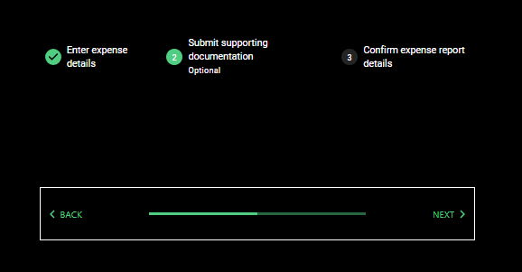
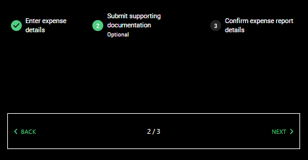
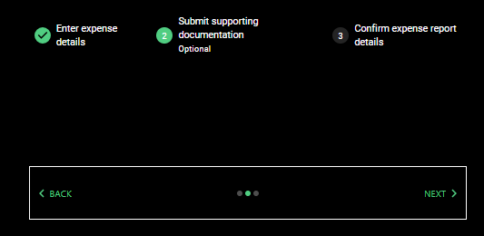

# Material UI Stepper component for Power Apps (PCF COMPONENT)

## Description
###

## Table of Contents

- [Demo](#Demo)
- [Input Properties](#input-properties)
- [Output properties](#output-properties)
- [Events](#events)

## Demo
### Images of Stepper (bottom portion) are shown in conjunction with StepperHeader component (top portion)

# Input Properties Links

- [stepCount](#stepcount)
- [isSubmittable](#issubmittable)
- [variantType](#varianttype)
- [showBorder](#showborder)

- [useTestHarness](#usetestHarness)
- [useDarkMode](#usedarkmode)
- [primaryColor](#primarycolor)
- [containerWidth](#containerwidth)
- [containerHeight](#containerheight)

# Output Properties Links

- [outputCurrentStepIndex](#outputcurrentstepindex)

 

# Event links

- [OnSubmit](#onsubmit)

# Input Properties

 

## stepCount
### Type: whole number
### This is the total number of steps your Stepper should display.

 

## isSubmittable
### Type: boolean
### When turned on, there will be a submit button once you have reached the last step. When turned off, it will display the usual "next" button grayed out.

 

## variantType
### Type: dots | progress | text
### These are the variant types for the Stepper. With dots selected, the steps will be indicated by a series of dots, with the current step filled in with the primary color. With progress selected, it will be displayed as a progress bar that gradually fills up as more steps are completed. With text selected, it will be displayed as normal text, such as 1/3.

 

## showBorder
### Type: boolean
### When turned on, this will display a border around the component, white in dark mode, black in light mode.

 

## useTestHarness
### Type: boolean
### When turned on, the component will render using pre-defined test data. When turned off, it will render using your data from the Options property. Make sure you add your fields to the field well before turning this off. 

 

## useDarkMode
### Type: boolean;
### When turned on, this component renders in dark mode, when turned off it renders in light mode (why would you do that to yourself?)

 

## primaryColor
### Type: string;
### This property will determine the color theme that the control uses. Acceptable values can be found in styling/types/types.d.ts from the root. If no value option is passed, it will use the Green theme.

 

## containerWidth
### Type: number
### A necessary property due to a bug on Microsoft's side that causes components to occassionally not fill their parent container, even when using the context.mode.trackContainerResize() function. The default value is Self.Width, and that's what it should remain as. 

 

## containerHeight
### Type: number
### A necessary property due to a bug on Microsoft's side that causes components to occassionally not fill their parent container, even when using the context.mode.trackContainerResize() function. The default value is Self.Height, and that's what it should remain as. 

 

# Output properties

## outputCurrentStepIndex
### Type: whole number
### This will be the index of the step that is active, 0 for the first step, 1 for the second step, and so on. Can be used in conjunction with StepperHeader

 

# Events

## OnSubmit
### This event will fire when you have the isSubmittable property turned on and you click the 'submit' button.

