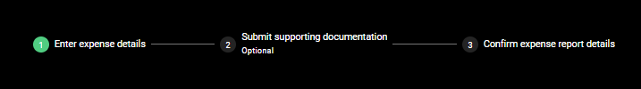

# Material UI Stepper Header component for Power Apps (PCF COMPONENT)

## Description
###

## Table of Contents

- [Demo](#Demo)
- [Input Properties](#input-properties)
- [Output properties](#output-properties)

## Demo




# Input Properties Links
- [Steps](#steps)
- [Fields](#fields)
- [activeStepIndex](#activestepindex)

- [useTestData](#usetestdata)
- [useDarkMode](#usedarkmode)
- [primaryColor](#primarycolor)
- [containerWidth](#containerwidth)
- [containerHeight](#containerheight)

# Output Properties Links

- [.Selected](#selected)

<br>

### Example data used in the testData property
```
[
                    
    {
        stepTitle: "Enter expense details",
        isOptional: false,
    },
    {
        stepTitle: "Submit supporting documentation",
        isOptional: true
    },
    {
        stepTitle: "Confirm expense report details",
        isOptional: false
    }
]   
```

# Input Properties

<br>

## Steps
### Type: Table
### This is main table of steps that you will pull information from to display in the Stepper Header component. There are two main properties that are relevant to each row in the table: 
- #### stepTitle: string - the text displayed in the step
- #### isOptional: boolean - when set to true, will display a label that says "Optional" beneath the stepTitle

<br>

## Fields 
### This property is contained within Power Apps itself, it won't appear in the code here, but it is a field well in power apps that will allow you to select which fields are passed to the component.


<br>

## activeStepIndex
### Type: number
### This will be which step is displayed is active in the Stepper Header. Please note that the index begins at 0, so if you want to set the first step as active, set it to 0, then 1 for the 2nd step, and so on. This is usually used in conjunction with a variable.

<br>

## useTestData
### Type: boolean
### When turned on, the component will render using pre-defined test data. When turned off, it will render using your data from the Options property. Make sure you add your fields to the field well before turning this off. 

<br>

## useDarkMode
### Type: boolean;
### When turned on, this component renders in dark mode, when turned off it renders in light mode (why would you do that to yourself?)

<br>

## primaryColor
### Type: string;
### This property will determine the color theme that the control uses. Acceptable values can be found in styling/types/types.d.ts from the root. If no value option is passed, it will use the Green theme.

<br>

## containerWidth
### Type: number
### A necessary property due to a bug on Microsoft's side that causes components to occassionally not fill their parent container, even when using the context.mode.trackContainerResize() function. The default value is Self.Width, and that's what it should remain as. 

<br>

## containerHeight
### Type: number
### A necessary property due to a bug on Microsoft's side that causes components to occassionally not fill their parent container, even when using the context.mode.trackContainerResize() function. The default value is Self.Height, and that's what it should remain as. 

<br>


# Output properties

## .Selected
### Type: Record (dynamic)
### This property functions just like a normal .Selected in a gallery in Power Apps, it will output the entire record of what you have selected, in this case the active step

<br>


