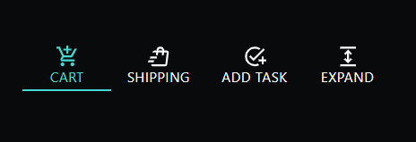
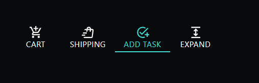
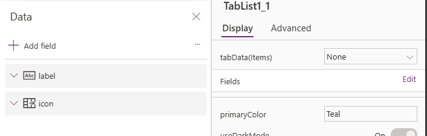

# Material UI TAB LIST (PCF COMPONENT)

## Description
### This component is a Tab List PCF component, meant to display a horizontal list of text and/or icons that can be toggled between to display different UI elements depending upon which tab is selected. It can be quite an aesthetically appealing way to give users the option to quickly toggle between tabs without having to change screens.

## Table of Contents

- [Demo](#Demo)
- [Input Properties](#input-properties)
- [Output properties](#output-properties)

## Demo






# Input Properties Links
- [Fields](#fields)
- [tabData](#tabdata)


<br>

# Input Properties

<br>

## Fields 
This property is contained within Power Apps itself, it won't appear in the code here, but it is a field well in power apps that will allow you to select which fields are passed to the component.



<br>

## tabData
### Type: Table
### This is the main table of data you'll pass in to create your tabs. Each record in this table needs at least one of these two properties to be a successful tab:
- #### label (string): This will be the label text that shows up below your icon. If you do not have an icon, it will display directly below where the icon would have been. It is recommended to either use labels for all tabs or not use labels at all, and just use icons.
- #### icon (object): This is an object that must have a 'd' property that represents a single draw path for an svg icon. You can use any svg with one 'd' property for this, but the recommended path is to visit https://fonts.google.com/icons (they have thousands of icons which I believe all have just one 'd' property), download the icon as an svg, and copy the 'd' from the path in the svg. For example, the if you wanted to display a search icon for one of your tabs, the icon property would be: 
```
icon: {
    d: "M784-120 532-372q-30 24-69 38t-83 14q-109 0-184.5-75.5T120-580q0-109 75.5-184.5T380-840q109 0 184.5 75.5T640-580q0 44-14 83t-38 69l252 252-56 56ZM380-400q75 0 127.5-52.5T560-580q0-75-52.5-127.5T380-760q-75 0-127.5 52.5T200-580q0 75 52.5 127.5T380-400Z"
}
```

### NOTE: The two properties listed above are minimums, but you can add almost any other property you want in the field well as well, and it will be accessible in the .Selected property of the component. For example, if you don't want to include a label because you only want an icon, but you also want to dynamically change the visibility of other UI elements in the Power Apps Canvas, you can add a property called selectedTab to differentiate between what tab is selected. This is only necessary if you don't have a 'label' property, otherwise you could just use that.

<details open>

<summary style="font-size: 12pt">Code for test items</summary>
This is the code we will be using for our demonstrations

```
[
    {
        label: "Add to cart",
        icon: {d: "M440-600v-120H320v-80h120v-120h80v120h120v80H520v120h-80ZM280-80q-33 0-56.5-23.5T200-160q0-33 23.5-56.5T280-240q33 0 56.5 23.5T360-160q0 33-23.5 56.5T280-80Zm400 0q-33 0-56.5-23.5T600-160q0-33 23.5-56.5T680-240q33 0 56.5 23.5T760-160q0 33-23.5 56.5T680-80ZM40-800v-80h131l170 360h280l156-280h91L692-482q-11 20-29.5 31T622-440H324l-44 80h480v80H280q-45 0-68.5-39t-1.5-79l54-98-144-304H40Z"}

    },
    {
        label: "Shipping",
        icon: {
            d: "m40-240 20-80h220l-20 80H40Zm80-160 20-80h260l-20 80H120Zm623 240 20-160 29-240 10-79-59 479ZM240-80q-33 0-56.5-23.5T160-160h583l59-479H692l-11 85q-2 17-15 26.5t-30 7.5q-17-2-26.5-14.5T602-564l9-75H452l-11 84q-2 17-15 27t-30 8q-17-2-27-15t-8-30l9-74H220q4-34 26-57.5t54-23.5h80q8-75 51.5-117.5T550-880q64 0 106.5 47.5T698-720h102q36 1 60 28t19 63l-60 480q-4 30-26.5 49.5T740-80H240Zm220-640h159q1-33-22.5-56.5T540-800q-35 0-55.5 21.5T460-720Z" 
            }

    },
    {
        label: "Add task",
        icon: {
            d: "M480-80q-83 0-156-31.5T197-197q-54-54-85.5-127T80-480q0-83 31.5-156T197-763q54-54 127-85.5T480-880q65 0 123 19t107 53l-58 59q-38-24-81-37.5T480-800q-133 0-226.5 93.5T160-480q0 133 93.5 226.5T480-160q32 0 62-6t58-17l60 61q-41 20-86 31t-94 11Zm280-80v-120H640v-80h120v-120h80v120h120v80H840v120h-80ZM424-296 254-466l56-56 114 114 400-401 56 56-456 457Z" 
            }

    },
    {
        label: "Expand",
        icon: {
            d: "M160-80v-80h640v80H160Zm320-120L320-360l56-56 64 62v-252l-64 62-56-56 160-160 160 160-56 56-64-62v252l64-62 56 56-160 160ZM160-800v-80h640v80H160Z"
        }
    }
]
```


</details>


