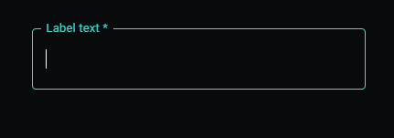

# Material UI Data Table/Grid for Power Apps (PCF COMPONENT)

## Description
###

## Table of Contents

- [Demo](#Demo)
- [Input Properties](#input-properties)
- [Output properties](#output-properties)

## Demo

# Input Properties Links

- [useDarkModel](#usedarkmode)
- [primaryColor](#primarycolor)
- [isMultiline](#ismultiline)
- [labelText](#labeltext)
- [defaultText](#defaulttext)
- [allowNumbersOnly](#allownumbersonly)
- [isCurrency](#iscurrency)
- [isRequired](#isrequired)
- [isEditable](#iseditable)

# Output Properties Links

- [outputText](#outputtext)
- [outputHeight](#outputheight)

# Input Properties

## useDarkMode
### Type: boolean
### This property controls whether the control is rendered in light or dark mode

 

## primaryColor
### Type: string
### This property controls what pre-defined color scheme the control uses. The list of options can be found in styling\types\types.d.ts from the project root. The default value is Green, which is what will also render if you try to pass in an invalid value

 

## isMultiline
### Type: boolean
### This controls whether the user input will display as a single line of text, or if the control will grow to new lines once the user puts in enough characters. If this property is set to false, when the user puts in enough characters to be near the end of the input, the input will begin to scroll as the user types to keep their most recent input in view. If it is set to false, the component will continuously generate new lines as needed.

 

## labelText
### Type: string
### This property controls what the label text for the control is

 

## defaultText
### Type: string
### This property controls what the default text displayed in the input will be. Changing the defaultText via any method will cause the new defaultText to override any changes the user may have made. For example, if you are displaying controls that are supposed to be defaulting to a property from the selected item in a gallery, selecting a new item from the gallery will override any changes the user may have made, so make sure you save those changes before changing the default value

 

## allowNumbersOnly
### Type: boolean
### When set to true, this property will prevent the text input from accepting values other than negative signs, decimal points, and digits

 

## isCurrency
### Type: boolean
### When turned on, this will only allow the number inputs listed above, but will also display the $ symbol at the start of the input. As of right now, this will NOT include the $ sign in the output properties

 

## isRequired
### Type: boolean
### When set to true, this will include a * at the end of the label

 

## isEditable
### Type: boolean
### When set to false, this changes the component to a read-only mode. The user will still be able to copy the text inside the input, and the input can still be changed by changing the defaultText property, but the user will not be able to manually edit it.

 

# Output properties

## outputText
### Type: string
### This property outputs the current value of the input

 

## outputHeight
### Type: number
### This control outputs the total rendered height of the actualy MUI component itself. This is useful when you have the isMultiline property set to true, and would like the parent control height to match the actual rendered height. 

 

