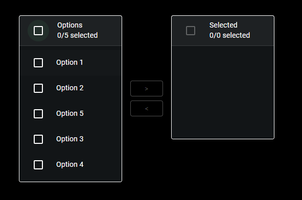
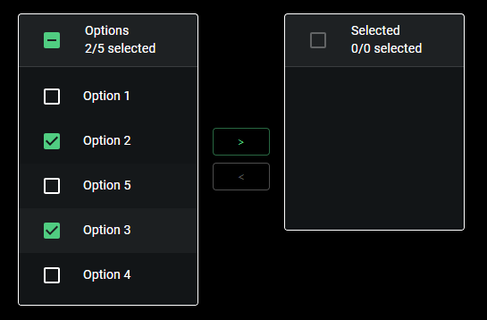
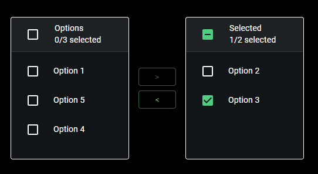

# Material UI Transfer List component for Power Apps (PCF COMPONENT)

## Description
###

## Table of Contents

- [Demo](#Demo)
- [Input Properties](#input-properties)
- [Output properties](#output-properties)

## Demo








# Input Properties Links
- [Fields](#fields)
- [initialChoices](#initialchoices)
- [displayField](#displayfield)
- [leftBucketName](#leftbucketname)
- [rightBucketName](#rightbucketname)
- [containerWidth](#containerwidth)
- [containerHeight](#containerheight)
- [useDarkMode](#usedarkmode)

# Output Properties Links

- [.SelectedItems](#selecteditems)

 # Events Links

- [onMoveItems](#onmoveitems)

<br>
<br>

# Input Properties

<br>

## Fields 
This property is contained within Power Apps itself, it won't appear in the code here, but it is a field well in power apps that will allow you to select which fields are passed to the component.


<br>

## initialChoices
### Type: Table
### This is the main list of options that you want to start in the left bucket of the transfer list. It accepts any type of record.

## displayField
### Type: string;
### This property is what the component will use to determine what to display as the text for the option. For example, if a row in your initialChoices is something like this
```
{
    field1: "Value 1",
    field2: "Value 2"
}
```

### and you have the displayField property set to field1, the option would display Value 1, but if you have the displayField set to field2, it would display Value 2

<br>

## primaryColor
### Type: string;
### This property will determine the color theme that the control uses. Acceptable values can be found in styling/types/types.d.ts If no value option is passed, it will use the Green theme.

<br>

## leftBucketName
### Type: string
### This will be the name displayed for the left bucket

<br>

## rightBucketName
### Type: string
### This will be the name displayed for the right bucket

<br>

## useDarkMode
### Type: boolean;
### When turned on, this component renders in dark mode, when turned off it renders in light mode (why would you do that to yourself?)

<br>

## containerWidth
### Type: number
### A necessary property due to a bug on Microsoft's side that causes components to occassionally not fill their parent container, even when using the context.mode.trackContainerResize() function. The default value is Self.Width, and that's what it should remain as. 

<br>

## containerHeight
### Type: number
### A necessary property due to a bug on Microsoft's side that causes components to occassionally not fill their parent container, even when using the context.mode.trackContainerResize() function. The default value is Self.Height, and that's what it should remain as. 


<br>

# Output properties

## .SelectedItems
### Type: Table
### Like any dataset control, you can use ControlName.SelectedItems to get the items that have been selected, which in this case are the items the user moved to the right bucket

<br>

# Events

## onMoveItems
### This event will fire when item(s) are moved to either bucket. Useful for using live updates when transferring between buckets

<br>


