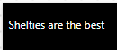

# Material UI bodyText component for Power Apps (PCF COMPONENT)

## Description
### This component is part of a typography set that is meant to create consisted, scaled typography. I believe I used the 'perfect fifth' ratio when developing the typography set, as it offers fairly large contrast in type sizes, and most Power Apps are relatively simple, so they benefit from larger type size differences. Other typography components include h1, h2, h3, and smallText 

## Table of Contents

- [Demo](#Demo)
- [Input Properties](#input-properties)
- [Output properties](#output-properties)

## Demo

# Input Properties Links

- [Text](#text)
- [isBold](#isbold)
- [isItalic](#isitalic)
- [TextAlign](#textalign)
- [paddingLeft](#paddingleft)
- [paddingTop](#paddingtop)
- [paddingRight](#paddingright)
- [paddingBottom](#paddingbottom)
- [fontColor](#fontcolor)
- [autoHeight](#autoheight)
- [overflow](#overflow)
- [outputHeight](#outputheight)
- [containerHeight](#containerheight)
- [containerWidth](#containerWidth)

# Input Properties

 

## Text
### Type: string
### This is the text that will be displayed inside the component

 

## isBold
### Type: boolean
### When turned on, the font will be bold

 

## isItalic
### Type: boolean
### When turned on, the font will be italicized 

 

## TextAlign
### Type: left | center | right
### Controls where the text is aligned horizontally in the control. The default is left, which means each line starts on the same left edge. Center will cause the text to be centered in the control, which will create jagged edges on left and right, and the value of right will cause each line to END on the same right line at the end of the control, which will create a jagged left edge. It is typically best practice to use left-aligned text, especially in smaller / body text 

 

## Padding
### Type: number
### There are 4 paddings: paddingLeft, paddingTop, paddingRight, and paddingBottom. You can think of padding as an invisible border that pushes from the component inwards, instead of outwards like normal borders. For example, the default padding of 8px will create an 8 pixel border on the inside of the component that keeps the text from coming too close to the edges. The individual padding properties control where padding is applied - paddingTop applies padding from the top pressing down, paddingLeft applies padding from the left pressing right, etc.

 

## fontColor
### Type: string
### This is color of the text to be displayed in the control. The default value is black if the global variable 'varUseDarkMode' is set to false, and white if it is set to true. Aside from this, you can pass in any normal web development colors such as blue, seagreen, and whitesmoke, or use hex codes such as #FFFFFF (you can also include transparency)

 

## autoHeight
### Type: boolean
### When turned on, this control will ignore the component's height and automatically expand to display all text inside. When turned off, this behavior is managed by the 'overflow' property

 

## overflow
### Type: visible | hidden | scroll
### This will control the visibility of the overflow when the 'autoHeight' property is set to false. When set to visible, the full text will be displayed. When set to hidden, the component will cut off the text with no indication there is any other text to see. When set to scroll, any overflow text will be cut off, but the component will have a scrollbar where the user can scroll to see the rest of the text

 

## containerWidth
### Type: number
### A necessary property due to a bug on Microsoft's side that causes components to occassionally not fill their parent container, even when using the context.mode.trackContainerResize() function. The default value is Self.Width, and that's what it should remain as. 

 

## containerHeight
### Type: number
### A necessary property due to a bug on Microsoft's side that causes components to occassionally not fill their parent container, even when using the context.mode.trackContainerResize() function. The default value is Self.Height, and that's what it should remain as. 

 

# Output properties

 

## outputHeight
### This is the total height of the displayed contents of the control. This is useful when you want to use the 'autoHeight' property, but still want to know just how high the component is. This is usually used for dynamic positioning.