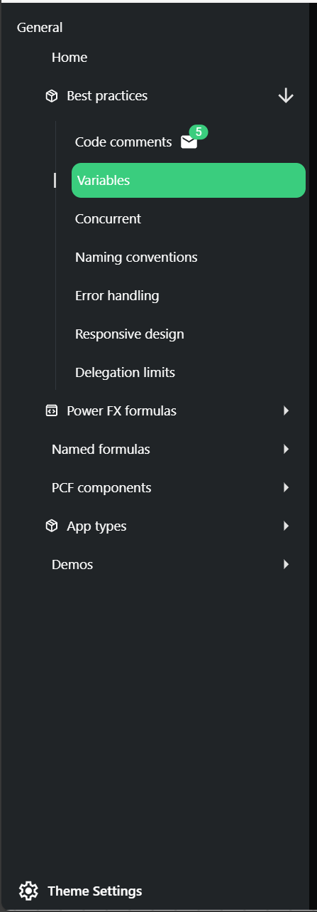

# Sleek MUI Sidebar

## Description
This sidebar is a multi-level expanding and collapsing sidebar that will allow you to infuse professional and aesthetically pleasing navigation into your application.

## Table of Contents

- [Demo](#Demo)
- [Input Properties](#input-properties)
- [Output properties](#output-properties)

## Demo




# Input Properties links
- [Fields](#fields)
- [navItems](#navitems)
- [primaryColor](#activescreen)
- [activeScreen](#activescreen)
- [containerHeight](#containerheight)
- [containerWidth](#containerwidth)
- [useDarkMode](#usedarkmode)
- [useTestData](#usetestdata)

# Output properties links
- [outputPrimaryColor](#outputprimarycolor)
- [outputScreenName](#outputscreenname)
- [outputUseDarkMode](#outputusedarkmode)

# Events links

- [onChangePrimaryColor](#onchangeprimarycolor)
- [onChangeColorMode](#onchangecolormode)
- [onChangeScreen](#onchangescreen)

<br>
<br>

# Input Properties

<br>

## Fields 
This property is contained within Power Apps itself, it won't appear in the code here, but it is a field well in power apps that will allow you to select which fields are passed to the component.


<br>

## navItems
### Type: Table (required)
### This table will be the table of navigation items that you want the sidebar to display. Each parent level object will be a "section", which is basically a heading used to group navigation items together. The parent objects will have the following properties:
- ### sectionTitle (required - string): The section title will be the text you want displayed as your section header.
- ### isHidden (optional - boolean): Set this property to dynamically hide entire sections based on security implementations. For example, if you had a single-column collection of users named Admins you want to have access to an admin section, but no one else, you would set the isHidden property on the admin section to be !User().Email in Admins
- ### children ( required: array ): This is the navigation items that will render under the parent section. If this item does not have any children itself, it will be a normal selectable navigation item. If it does have children, it will render as an expand/collapse item to show the children. Each child of a section has the following available properties:
    ### 1. navTitle (required - string): This is the display text for the navigation item.
    ### 2. icon (optional - string): This renders an icon based on a single-path svg. You can find useable icons by going to https://fonts.google.com/icons, finding the icon you want, exporting it as svg, and extracting the 'd' property from the svg.
    ### 3. isHidden (optional - boolean): This operates exactly the same as the isHidden in the parent section, except it only controls visibility for this item
    ### 4. children (optional - array): This is a child navigation item that will be rendered under the parent, and gives the parent an expand/collapse functionality instead of a normal navigation functionality. The children here have all the same properties as parent, except it can't have more children itself (currently limited to 3 layers deep - Section, parent, child. Will eventually switch to a recursive function that renders infinitely )
    ### 5. badge (optional) - This is the property that will cause a badge to render on the nav item. The badge property is an object with two parameters: 
    1. icon: this will be the 'd' property from any Material font icon, you can get this by going to https://fonts.google.com/icons and downloading the svg file from there, and copying the 'd' property from the path. This will translate to the icon you see in Material font icons
    2. badgeContent (number): This will be the number that is displayed in the little circle beside the icon 

### Example code (App.Formulas):
```
sidebarNavigation = [
    {
        // Section
        sectionTitle: "General",  
        isHidden: false,
        children: [
            //Parents
            {navTitle: "Home"},
            {
                navTitle: "Best practices", 
                icon: "M440-183v-274L200-596v274l240 139Zm80 0 240-139v-274L520-457v274Zm-80 92L160-252q-19-11-29.5-29T120-321v-318q0-22 10.5-40t29.5-29l280-161q19-11 40-11t40 11l280 161q19 11 29.5 29t10.5 40v318q0 22-10.5 40T800-252L520-91q-19 11-40 11t-40-11Zm200-528 77-44-237-137-78 45 238 136Zm-160 93 78-45-237-137-78 45 237 137Z", 
                children: [
                    //Children
                    {navTitle: "Code comments"},
                    {navTitle: "Variables"},
                    {navTitle: "Concurrent"},
                    {navTitle: "Naming conventions"},
                    {navTitle: "Error handling"},
                    {navTitle: "Responsive design"},
                    {navTitle: "Delegation limits"}
                ]
            },
        {navTitle: "Power FX formulas", icon: "M200-120q-33 0-56.5-23.5T120-200v-500q0-14 4.5-26.5T138-750l56-68q9-11 20.5-16.5T240-840h480q14 0 25.5 5.5T766-818l56 68q9 11 13.5 23.5T840-700v500q0 33-23.5 56.5T760-120H200Zm16-600h528l-34-40H250l-34 40Zm-16 520h560v-440H200v440Zm382-78 142-142-142-142-58 58 84 84-84 84 58 58Zm-202 0 58-58-84-84 84-84-58-58-142 142 142 142Zm-180 78v-440 440Z", children: [
            {navTitle: "Power FX Overview"},
            {navTitle: "Set"},
            {navTitle: "UpdateContext"},
            {navTitle: "With"},
            {navTitle: "ClearCollect"},
            {navTitle: "Collect"},
            {navTitle: "Clear"},
            {navTitle: "Remove"},
            {navTitle: "RemoveIf"},
            {navTitle: "LookUp"},
            {navTitle: "Filter"},
        ]},
        {
            navTitle: "Named formulas",
            children: [
                {navTitle: "Overview"},
                {navTitle: "Basic named formulas"},
                {navTitle: "User-defined formulas"},
                {navTitle: "User-defined types"}
            ]
        },
        {
            navTitle: "PCF components",
            children: [
                {navTitle: "Overview"},
                {navTitle: "Pre-requisites"},
                {navTitle: "Create component library"},
                {navTitle: "Create a PCF component"},
                {navTitle: "Common/useful code"},
                {navTitle: "Publishing/pushing changes"},

            ]
        },
        {
            navTitle: "App types",
            icon: "M440-183v-274L200-596v274l240 139Zm80 0 240-139v-274L520-457v274Zm-80 92L160-252q-19-11-29.5-29T120-321v-318q0-22 10.5-40t29.5-29l280-161q19-11 40-11t40 11l280 161q19 11 29.5 29t10.5 40v318q0 22-10.5 40T800-252L520-91q-19 11-40 11t-40-11Zm200-528 77-44-237-137-78 45 238 136Zm-160 93 78-45-237-137-78 45 237 137Z",
            children: [
                {navTitle: "Canvas"},
                {navTitle: "Model-driven"}
            ]
        },
        {
        navTitle: "Demos",
        isHidden: false,
        children: [
            {navTitle: "Data table"}
        ]
    }
    ]},
    
];

```

## primaryColor
### Type: string (optional)
### This property is the primary color that Material UI will use for theming. There is a select list of pre-defined options in the styling/types/types.d.ts file from root

<br>

## activeScreen
### Type: string (optional but recommended)
### This property controls which navigation item gets highlighted to showcase which screen is active. It defaults to the name of the current screen, but can be hard-coded to show specific screens. For example, if you have 3 screens - [Buildings, Create building, Edit Building], you may want Create building and Edit building to show the Buildings screen as active, because you don't want to display the other 2 in the navigation tree. This is especially useful for screens that can't be navigated to directly since they rely on context variables being passed in from other screens.

<br>

## containerHeight
### Type: number (required)
### This property is necessary due to some glitches on the Power Apps framework where the context.mode.allocatedHeight does not always work properly. This defaults to Self.Height, and that's what it should remain as.

<br>

## containerWidth
### Type: number (required)
### This property is necessary due to some glitches on the Power Apps framework where the context.mode.allocatedWidth does not always work properly. This defaults to Self.Width, and that's what it should remain as.

<br>

## useDarkMode
### Type: boolean
### This property controls whether the control uses a dark mode theme. Not much practical difference to the aesthetic at this time, as it uses a dark background in both dark and light mode.

<br>

## useTestData
### Type: boolean
### When set to true, the component uses pre-defined data to simulate a fully functional navigation tree. Once you have defined your navigation items and added your fields to the fields well, turn this off

<br>


# Output properties

<br> 

## outputPrimaryColor
### Type: string
### This property is used in the onChangePrimaryColor event so that the sidebar can update app variables to trigger theme changes in the rest of your app components

<br>

## outputScreenName
### Type: string
### This property is used in the onChangeScreen event to read the newly selected screen you want to navigate to

<br>

## outputUseDarkMode
### Type: boolean
### This property is used in the onChangeColorMode event to switch app variables to control global theming for dark/light mode

<br>

# Events

## onChangePrimaryColor
### This event triggers whenever a new color is selected from the drawer that pops up when you select 'Theme Settings'. The default value of this event is meant to change a global variable called 'varAppPrimaryColor' to the newly selected color. Recommended course of action is to leave this as-is.

<br>

## onChangeColorMode
### This event triggers whenever you toggle between light and dark mode in the drawer that pops up when you select 'Theme Settings' at the bottom of the sidebar. The default value of this is meant to change a global variable called 'varUseDarkMode' to true if you selected Dark, and false is you selected Light for the color mode. Recommended course of action is to leave this as-is

## onChangeScreen
### This event triggers when you select a screen from the sidebar. This will NOT be triggered when you expand/collapse labels with multiple child screens, only when you select a label with no children. This event is meant for the developer to implement screen changes based on the user's selection of a new screen. There is no default value, as the implementation of this could potentially vary depending on your use case. The recommended implementation is this:
 ### 1. Create an array in your App.Formulas property that will contain the list of items you want displayed as the navigation tree (see the navItems section earlier in this documentation for reference. )
 ### 2. Create an array in your App.Formulas that just contains the screen controls themselves for screens you want to navigate to. Continuing the example from navItems section, your screens could look something like this: 
 
 ### 3. In your onChangeScreen event, you use the 'outputScreenName', which is the screen the user selected, to look up your collection of screens to find the screen to navigate to, then navigate to it. Continuing our earlier example, the onChangeScreen formula would be: 
 
 ### After that, your sidebar will navigate correctly. You can even create a custom formula in your App.Formulas to make it repeatable code, if you want: 
 
 
