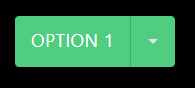
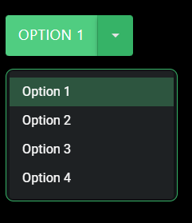

# Material UI squashedButtonGroup component for Power Apps (PCF COMPONENT)

## Description
### This is a component that will render the current "option" as a button, and attached to the button there will be a drop-down icon to pull up a list of other options to change your button to. It is essentially a more space-efficient way to store lots of buttons/options in a single area. Particulary useful when combined with data tables. For example, you can have a button group that have different buttons such as "Delete selected rows", "Edit row", "Add row", etc.

## Table of Contents

- [Demo](#Demo)
- [Input Properties](#input-properties)
- [Output properties](#output-properties)
- [Events](#events)

## Demo






# Input Properties Links
- [Options](#options)
- [Fields](#fields)
- [displayField](#displayfield)
- [isDisabled](#isdisabled)
- [flexibleWidth](#flexiblewidth)
- [outputWidth](#outputWidth)
- [useTestData](#usetestdata)
- [useDarkMode](#usedarkmode)
- [primaryColor](#primarycolor)
- [containerWidth](#containerwidth)
- [containerHeight](#containerheight)

# Output Properties Links

- [outputWidth](#outputwidth)
- [outputSelectedOption](#outputselectedoption)

<br>

### Test Data
### The test data displayed in the demo is 
```
["Option 1", "Option 2", "Option 3", "Option 4"]
```

# Input Properties

<br>

## Options
### Type: Table
### This is the list of options that you want displayed in the drop-down list of options. They will be displayed in order, and the first option will be the originally active button. This accepts any record type.

<br>

## Fields 
### This property is contained within Power Apps itself, it won't appear in the code here, but it is a field well in power apps that will allow you to select which fields are passed to the component.


<br>

## displayField
### Type: string
### This is the field that will be displayed as text in your drop-down list of options. If you pass in an array of strings, such as 

```
["Option 1", "Option 2", "Option 3"," Option 4"]
```

### then you will only have one property available, Value. If you pass in objects with multiple properties, such as 

```
[ {Label: "Option1", ID: 1}, {Label: "Option2", ID: 2}, {Label: "Option3", ID: 3}  ]
```

### and you put "Label", it would display a list of Option 1, Option 2, Option 3. If you had put "ID", it would display a list of 1, 2, 3.

<br>

## isDisabled
### Type: boolean
### This controls whether the BUTTON portion is disabled. The drop-down portion is always enabled. This is because different options may have different criteria for what is disabled. For example, if you have a data table on the page, and have options such as "Edit row", "Delete selected rows", and "Add row", then the Add row would always be enabled, the Delete selected rows would be enabled if you have one OR MORE rows selected, and the Edit row would be enabled if you have one AND ONLY ONE row selected. You can achieve this functionality with a combination of using Switch and Self.outputSelectedOption. For example, if you want option 1 to be disabled unless you have exactly one row selected, but want all other options enabled, you could say 
```
Switch(
    Self.outputSelectedOption,
        CountRows(DataTable1.SelectedItems) <> 1,
            false
)
```

<br>

## flexibleWidth
### Type: boolean
### This determines whether the component will grow/shrink horizontally to fit the text of the option, or whether it will stay at a fixed width. Turning this property to true allows for component to grow/shrink horizontally.


<br>


## useTestData
### Type: boolean
### When turned on, the component will render using pre-defined test data. When turned off, it will render using your data from the Options property. Make sure you add your fields to the field well before turning this off. 

<br>

## useDarkMode
### Type: boolean;
### When turned on, this component renders in dark mode, when turned off it renders in light mode (why would you do that to yourself?)

<br>

## primaryColor
### Type: string;
### This property will determine the color theme that the control uses. Acceptable values can be found in styling/types/types.d.ts from the root. If no value option is passed, it will use the Green theme.

<br>

## containerWidth
### Type: number
### A necessary property due to a bug on Microsoft's side that causes components to occassionally not fill their parent container, even when using the context.mode.trackContainerResize() function. The default value is Self.Width, and that's what it should remain as. 

<br>

## containerHeight
### Type: number
### A necessary property due to a bug on Microsoft's side that causes components to occassionally not fill their parent container, even when using the context.mode.trackContainerResize() function. The default value is Self.Height, and that's what it should remain as. 

<br>


# Output properties

<br>

## outputSelectedOption
### Type: string
### The text value of the currently selected option

<br>

## outputWidth
### Type: number
### The total width of the actually rendered component. This is useful when you want to have flexible width, but need to communicate your width to other components so they can respond dynamically


