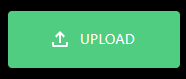
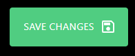
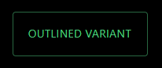

# Material UI component for Power Apps (PCF COMPONENT)

## Description
###

## Table of Contents

- [Demo](#Demo)
- [Input Properties](#input-properties)
- [Output properties](#output-properties)
- [Events](#events)

## Demo

# Input Properties Links
- [labelText](#labeltext)
- [variant](#variant)
- [isDisabled](#isdisabled)
- [startIconColor](#starticoncolor)
- [endIconColor](#endiconcolor)
- [startIconSVG](#starticonsvg)
- [endIconSVG](#endiconsvg)
- [useDarkMode](#usedarkmode)
- [PrimaryColor](#primarycolor)
- [containerWidth](#containerwidth)
- [containerHeight](#containerheight)

 

 # Events Links

 

- [OnClick](#onclick)

 

# Input Properties

## labelText
### Type: string
### The text that will be displayed in the label

 

## variant
### Type: contained | outlined | text
### Controls the type of button:
- #### contained: displays as a normal clickable button, with a body filled in with the primary theme color
- #### outlined: displays an empty body with text and a border of the primary theme color
- #### text: displays as simple clickable text using the primary theme color

 

## isDisabled
### Type: boolean
### When turned on, will be displayed in a disabled state, and will no longer be clickable

 

## startIconColor
### Type: string
### This will be the color of the startAdornment for the button, the icon displayed before the button text. Any color value that can be displayed as pure text is acceptable, including
- #### Normal web development color names such as blue, green, and whitesmoke
- #### hex codes such as #FFFFFF

 

## endIconColor
### Type: string
### This will be the color of the endAdornment for the button, the icon displayed after the button text. Any color value that can be displayed as pure text is acceptable, including
- #### Normal web development color names such as blue, green, and whitesmoke
- #### hex codes such as #FFFFFF

 

## startIconSVG
### Type: string
### Renders an icon before the button text. The icon here is rendered as a simple SVG with one 'path' element, which in turn will pass in this text to the 'd' property. The easiest way to implement this is: 
- #### Visit https://fonts.google.com/icons
- #### Search for an icon you like
- #### Click the icon and download the SVG if you want to use a browser, or copy the icon to your clipboard if you want to open it in an IDE like VS Code
- #### Open either in an IDE such as VS Code, or a web browser like Chrome
- #### If using an IDE, copy the 'd' property, if using a browser hover over the icon, right click, hit inspect, and copy the 'd' property from the element
- #### Paste the text from the 'd' property into the startIconSVG property in Power Apps

 

## endIconSVG
### Type: string
### Renders an icon after the button text. The icon here is rendered as a simple SVG with one 'path' element, which in turn will pass in this text to the 'd' property. The easiest way to implement this is: 
- #### Visit https://fonts.google.com/icons
- #### Search for an icon you like
- #### Click the icon and download the SVG if you want to use a browser, or copy the icon to your clipboard if you want to open it in an IDE like VS Code
- #### Open either in an IDE such as VS Code, or a web browser like Chrome
- #### If using an IDE, copy the 'd' property, if using a browser hover over the icon, right click, hit inspect, and copy the 'd' property from the element
- #### Paste the text from the 'd' property into the endIconSVG property in Power Apps

## useDarkMode
### Type: boolean;
### When turned on, this component renders in dark mode, when turned off it renders in light mode (why would you do that to yourself?)

 

## primaryColor
### Type: string;
### This property will determine the color theme that the control uses. Acceptable values can be found in styling/types/types.d.ts from the root. If no value option is passed, it will use the Green theme.

 

## containerWidth
### Type: number
### A necessary property due to a bug on Microsoft's side that causes components to occassionally not fill their parent container, even when using the context.mode.trackContainerResize() function. The default value is Self.Width, and that's what it should remain as. 

 

## containerHeight
### Type: number
### A necessary property due to a bug on Microsoft's side that causes components to occassionally not fill their parent container, even when using the context.mode.trackContainerResize() function. The default value is Self.Height, and that's what it should remain as. 

 

# Events

 

## OnClick
### This event will fire when the button is clicked

