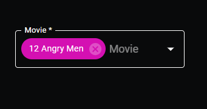
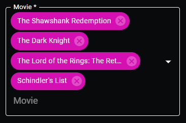
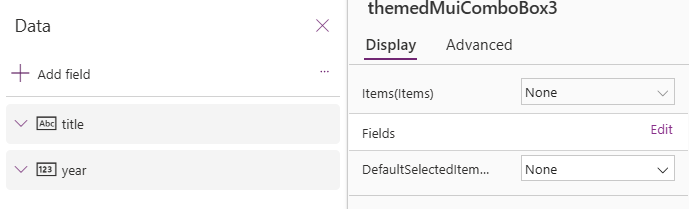
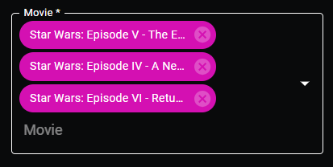

# Themed MUI Combo Box

## Description
This combo box is an aesthetically pleasing alternative to the vanil

## Table of Contents

- [Demo](#demo)


## Demo





# Input Properties links
- [Fields](#fields)
- [Items](#items)
- [defaultSelectedItems](#defaultselecteditems)
- [useDarkMode](#usedarkmode)
- [useTestData](#usetestdata)
- [labelText](#labeltext)
- [primaryColor](#primarycolor)
- [displayField](#displayfield)
- [allowSelectMultiple](#allowselectmultiple)
- [containerWidth](#containerwidth)


# Output properties links

- [searchText](#searchtext)
- [outputHeight](#outputheight)


<br>

# Input Properties

## Fields 
This property is contained within Power Apps itself, it won't appear in the code here, but it is a field well in power apps that will allow you to select which fields are passed to the component.



<br>

## Items
### Type: Table
### This property will be the main table of items that you will want to be displayed in the drop down list of items. The example items used in this demo and the testData are
<details open style="font-size: 14pt">
<summary>Test data</summary>

``` 
[
    { title: "The Shawshank Redemption", year: 1994 },
    { title: "The Godfather", year: 1972 },
    { title: "The Godfather: Part II", year: 1974 },
    { title: "The Dark Knight", year: 2008 },
    { title: "12 Angry Men", year: 1957 },
    { title: "Schindler's List", year: 1993 },
    { title: "Pulp Fiction", year: 1994 },
    {
      title: "The Lord of the Rings: The Return of the King",
      year: 2003
    },
    { title: "The Good, the Bad and the Ugly", year: 1966 },
    { title: "Fight Club", year: 1999 },
    {
      title: "The Lord of the Rings: The Fellowship of the Ring",
      year: 2001
    },
    {
      title: "Star Wars: Episode V - The Empire Strikes Back",
      year: 1980
    },
    { title: "Forrest Gump", year: 1994 },
    { title: "Inception", year: 2010 },
    {
      title: "The Lord of the Rings: The Two Towers",
      year: 2002
    },
    { title: "One Flew Over the Cuckoo's Nest", year: 1975 },
    { title: "Goodfellas", year: 1990 },
    { title: "The Matrix", year: 1999 },
    { title: "Seven Samurai", year: 1954 },
    {
      title: "Star Wars: Episode IV - A New Hope",
      year: 1977
    },
    { title: "City of God", year: 2002 },
    { title: "Se7en", year: 1995 },
    { title: "The Silence of the Lambs", year: 1991 },
    { title: "It's a Wonderful Life", year: 1946 },
    { title: "Life Is Beautiful", year: 1997 },
    { title: "The Usual Suspects", year: 1995 },
    { title: "Léon: The Professional", year: 1994 },
    { title: "Spirited Away", year: 2001 },
    { title: "Saving Private Ryan", year: 1998 },
    { title: "Once Upon a Time in the West", year: 1968 },
    { title: "American History X", year: 1998 },
    { title: "Interstellar", year: 2014 },
    { title: "Casablanca", year: 1942 },
    { title: "City Lights", year: 1931 },
    { title: "Psycho", year: 1960 },
    { title: "The Green Mile", year: 1999 },
    { title: "The Intouchables", year: 2011 },
    { title: "Modern Times", year: 1936 },
    { title: "Raiders of the Lost Ark", year: 1981 },
    { title: "Rear Window", year: 1954 },
    { title: "The Pianist", year: 2002 },
    { title: "The Departed", year: 2006 },
    { title: "Terminator 2: Judgment Day", year: 1991 },
    { title: "Back to the Future", year: 1985 },
    { title: "Whiplash", year: 2014 },
    { title: "Gladiator", year: 2000 },
    { title: "Memento", year: 2000 },
    { title: "The Prestige", year: 2006 },
    { title: "The Lion King", year: 1994 },
    { title: "Apocalypse Now", year: 1979 },
    { title: "Alien", year: 1979 },
    { title: "Sunset Boulevard", year: 1950 },
    {
      title: "Dr. Strangelove or: How I Learned to Stop Worrying and Love the Bomb",
      year: 1964
    },
    { title: "The Great Dictator", year: 1940 },
    { title: "Cinema Paradiso", year: 1988 },
    { title: "The Lives of Others", year: 2006 },
    { title: "Grave of the Fireflies", year: 1988 },
    { title: "Paths of Glory", year: 1957 },
    { title: "Django Unchained", year: 2012 },
    { title: "The Shining", year: 1980 },
    { title: "WALL·E", year: 2008 },
    { title: "American Beauty", year: 1999 },
    { title: "The Dark Knight Rises", year: 2012 },
    { title: "Princess Mononoke", year: 1997 },
    { title: "Aliens", year: 1986 },
    { title: "Oldboy", year: 2003 },
    { title: "Once Upon a Time in America", year: 1984 },
    { title: "Witness for the Prosecution", year: 1957 },
    { title: "Das Boot", year: 1981 },
    { title: "Citizen Kane", year: 1941 },
    { title: "North by Northwest", year: 1959 },
    { title: "Vertigo", year: 1958 },
    {
      title: "Star Wars: Episode VI - Return of the Jedi",
      year: 1983
    },
    { title: "Reservoir Dogs", year: 1992 },
    { title: "Braveheart", year: 1995 },
    { title: "M", year: 1931 },
    { title: "Requiem for a Dream", year: 2000 },
    { title: "Amélie", year: 2001 },
    { title: "A Clockwork Orange", year: 1971 },
    { title: "Like Stars on Earth", year: 2007 },
    { title: "Taxi Driver", year: 1976 },
    { title: "Lawrence of Arabia", year: 1962 },
    { title: "Double Indemnity", year: 1944 },
    {
      title: "Eternal Sunshine of the Spotless Mind",
      year: 2004
    },
    { title: "Amadeus", year: 1984 },
    { title: "To Kill a Mockingbird", year: 1962 },
    { title: "Toy Story 3", year: 2010 },
    { title: "Logan", year: 2017 },
    { title: "Full Metal Jacket", year: 1987 },
    { title: "Dangal", year: 2016 },
    { title: "The Sting", year: 1973 },
    { title: "2001: A Space Odyssey", year: 1968 },
    { title: "Singin' in the Rain", year: 1952 },
    { title: "Toy Story", year: 1995 },
    { title: "Bicycle Thieves", year: 1948 },
    { title: "The Kid", year: 1921 },
    { title: "Inglourious Basterds", year: 2009 },
    { title: "Snatch", year: 2000 },
    { title: "3 Idiots", year: 2009 },
    { title: "Monty Python and the Holy Grail", year: 1975 },
] 

```
</details>

## DefaultSelectedItems
### Type: Table or Record (optional)
### This property will be what you pass in if you want certain items selected in the combo box by default. This is especially useful in situations where you want to edit existing records that have choice columns, where you want the combo box to pre-populate the options that are already selected in the record. The way the DefaultSelectedItems work is that for each option in the combo box, it will search for an object in the DefaultSelectedItems, and will select any option where the displayField properties match. The displayField property is a custom property which outlines which field the combo box should use for displaying options. For example, in the option
```
{ title: "The Shawshank Redemption", year: 1994 }
```
### if you have a displayField of 'title', it would display "The Shawshank Redemption", and would search your DefaultSelectedItems for an object with a 'title' property of "The Shawshank Redemption". You can pass in a table of values or a single record. Example DefaultSelectedItems:
```
Filter(colData, "Star Wars" in ThisRecord.title)
```
### This filters a collection called colData (which is just our testData we listed earlier) for any rows where 'Star Wars' is in the title. 



## useDarkMode
### Type: boolean
### This property simply toggles the control between displaying in light and dark mode, true will cause the control to render in Dark mode, and false will cause the control to render in Light mode

## useTestData
### Type: boolean
### This property controls whether the control will be rendered using the hard-coded test data, or if it will render using the custom Items property passed in. Setting this to false makes the component use the custom Items property, so it is recommended that you set up your Items, DefaultSelectedItems, and displayField before turning this off, otherwise it could render in weird ways.

## labelText
### Type: string
### This is the text that will be displayed in the label. DO NOT use an * here to indicate a required field, there is a separate property that automatically does so.

## primaryColor
### Type: string
### This is the theme color that the control will use to switch between pre-generated Material UI themes. The themes are custom developed by us, so there are a select list that can be used, you can find the full list at the styling\types\types.d.ts file from root. If you don't pass in a valid value, the default value is Green

## displayField
### Type: string
### This is the property that the control will use to display options inside the combo box, and the field that it will use to search the DefaultSelectedItems to pre-populate selected items. For example, in the following object
```
{ title: "The Shawshank Redemption", year: 1994 }
```
### there are only two fields that could be used as your displayField property - 'title' and 'year'. If you used 'title', then all the options in the combo box would display the text in their 'title' property, whereas if you used 'year' for your displayField, then all the options would display the text in their 'year' property. Make sure the field you select here is something that can be displayed as a single value, for example, you cannot pass it in something that ends up as an object or table itself. 

## allowSelectMultiple
### Type: boolean
### This property controls whether the control allows for multiple selections, or only allows for single selection. Setting this property to true allows for multiple selections

## isRequired
### Type: boolean
### This will simply display a * next to the label if this property is marked as true. I plan to use this in more advanced error-handling down the line, but for now it just displays the *. 

## containerWidth
### Type: number
### A necessary property due to a bug on Microsoft's side that causes components to occassionally not fill their parent container, even when using the context.mode.trackContainerResize() function. The default value is Self.Width, and that's what it should remain as. 

# Output properties

## searchText
### Type: string
### This output the search text in the combo box. This is useful for when you need to implement server-side or API functionality that requires strings of text to be passed in. I used it a lot with the Office365Users connector to search for Users since our organzation has way too many people to display in a single combo box. You can pass in APIs the search text to continuously update your Items property with new results based on your search text. 

## outputHeight
### Type: number

<br> 

# Events

<br>
