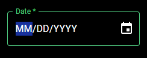

# Material UI Date Picker component for Power Apps (PCF COMPONENT)

## Description
###

## Table of Contents

- [Demo](#Demo)
- [Input Properties](#input-properties)
- [Output properties](#output-properties)
- [Events](#events)

## Demo

# Input Properties Links

- [labelText](#labeltext)
- [DefaultDate](#defaultdate)
- [isRequired](#isrequired)
- [useDarkMode](#usedarkmode)
- [primaryColor](#primarycolor)
- [containerWidth](#containerwidth)
- [containerHeight](#containerheight)

# Output Properties Links

- [selectedDate](#selecteddate)

# Input Properties

## labelText
### Type: string;
### This is the text that will be displayed in the label of the control

 

## DefaultDate
### Type: string
### This is the date that will be selected by default when the component renders

 

## isRequired
### Type: boolean
### Indicates whether the control represents a required field. When turned on, there will be a * after the label. That is currently the only functionality.

 

## useDarkMode
### Type: boolean;
### When turned on, this component renders in dark mode, when turned off it renders in light mode (why would you do that to yourself?)

 

## primaryColor
### Type: string;
### This property will determine the color theme that the control uses. Acceptable values can be found in styling/types/types.d.ts If no value option is passed, it will use the Green theme.

 

## containerWidth
### Type: number
### A necessary property due to a bug on Microsoft's side that causes components to occassionally not fill their parent container, even when using the context.mode.trackContainerResize() function. The default value is Self.Width, and that's what it should remain as. 

 

## containerHeight
### Type: number
### A necessary property due to a bug on Microsoft's side that causes components to occassionally not fill their parent container, even when using the context.mode.trackContainerResize() function. The default value is Self.Height, and that's what it should remain as. 

 

# Output properties

## selectedDate
### Type: Date
### The date outputted from the date picker

 