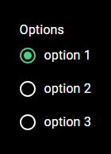

# Material UI Radio Group component for Power Apps (PCF COMPONENT)

## Description
###

## Table of Contents

- [Demo](#Demo)
- [Input Properties](#input-properties)
- [Output properties](#output-properties)

## Demo




# Input Properties Links
- [Fields](#fields)
- [Options](#options)
- [displayField](#displayfield)
- [labelText](#labeltext)
- [primaryColor](#primarycolor)
- [useDarkMode](#usedarkmode)
- [containerWidth](#containerwidth)
- [containerHeight](#containerheight)


# Output Properties Links

- [.Selected](#selected)

<br>
<br>

# Input Properties

## Fields 
### This property is contained within Power Apps itself, it won't appear in the code here, but it is a field well in power apps that will allow you to select which fields are passed to the component.


<br>

## Options
### Type: Table
### This table will be the options that are listed in your radio group. It accepts any type of record.

<br>

## displayField
### Type: string
### This property will control what text is displayed for your option. For example, if a row in your Options table is something like this
```
{
    field1: "Value 1",
    field2: "Value 2"
}
```

### and you have the displayField property set to field1, the option would display Value 1, but if you have the displayField set to field2, it would display Value 2

<br>

## labelText
### Type: string
### This is the text that is displayed in the label at the top of the component

<br>

## primaryColor
### Type: string
### This property will determine the color theme that the control uses. Acceptable values can be found in styling/types/types.d.ts If no value option is passed, it will use the Green theme.

<br>

## useTestData
### Type: boolean
### When turned on, the component will render using pre-defined test data. When turned off, it will render using your data from the Options property. Make sure you add your fields to the field well before turning this off. 

<br>

## containerWidth
### Type: number
### A necessary property due to a bug on Microsoft's side that causes components to occassionally not fill their parent container, even when using the context.mode.trackContainerResize() function. The default value is Self.Width, and that's what it should remain as. 

<br>

## containerHeight
### Type: number
### A necessary property due to a bug on Microsoft's side that causes components to occassionally not fill their parent container, even when using the context.mode.trackContainerResize() function. The default value is Self.Height, and that's what it should remain as. 

<br>

## useDarkMode
### Type: boolean
### When turned on, this component will render in dark mode. When turned off, it will render in light mode.

<br>

# Output properties

## .Selected
### Type: Record (dynamic)
### This will output the selected record from your option list

<br>


